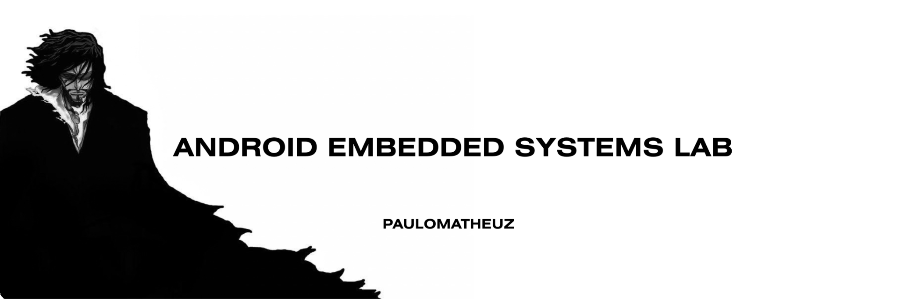

# O Caminho para o Eldorado

Repositório criado para registrar minha preparação para uma entrevista técnica voltada à área de Android embarcado no Instituto Eldorado.

A jornada reúne estudos direcionados e o desenvolvimento de três projetos em diferentes linguagens, com foco na revisão de fundamentos, na evolução da lógica de programação e na aplicação prática dos conhecimentos exigidos para a oportunidade.



## Status

🚧 Em desenvolvimento

Os projetos serão construídos e documentados progressivamente durante o período de preparação.

## Projetos

| Projeto    | Linguagem | Nível         | Status      |
| ---------- | --------- | ------------- | ----------- |
| Projeto 01 | C         | Simples       | ⏳ Planejado |
| Projeto 02 | Java      | Intermediário | ⏳ Planejado |
| Projeto 03 | Kotlin    | Intermediário | ⏳ Planejado |

As descrições, funcionalidades, instruções de execução e decisões técnicas de cada projeto serão adicionadas conforme o desenvolvimento avançar.

## Estrutura planejada

```text
o-caminho-para-eldorado/
├── projeto-c/
├── projeto-java/
├── projeto-kotlin/
└── README.md
```

Cada pasta terá sua própria documentação, contendo o objetivo do projeto, as funcionalidades implementadas, as tecnologias utilizadas e as instruções necessárias para executar o código.

## Tecnologias

* C;
* Java;
* Kotlin;
* Git;
* GitHub.

Outras ferramentas e tecnologias serão registradas conforme forem utilizadas nos projetos.

## Metodologia de desenvolvimento

O desenvolvimento será realizado de forma incremental. Cada projeto será dividido em pequenas etapas, permitindo compreender, implementar, testar e registrar cada evolução antes de avançar.

Os commits serão utilizados como uma linha do tempo do aprendizado, mostrando desde a estrutura inicial até a conclusão de cada aplicação.

## Objetivo

Mais do que uma preparação para uma entrevista, esta jornada representa uma oportunidade de transformar estudo em prática, fortalecer minha base como estudante de Engenharia de Software e demonstrar minha evolução por meio de projetos desenvolvidos com organização, clareza e responsabilidade.

Este é um projeto pessoal e educacional. O conteúdo deste repositório não representa o Eldorado e não utiliza informações internas, confidenciais ou proprietárias da instituição.

Desenvolvido por [Paulo Matheus](https://github.com/paulomatheuz).
