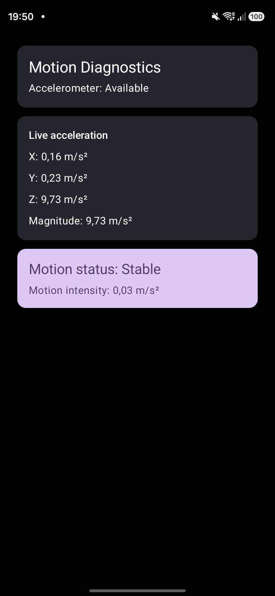
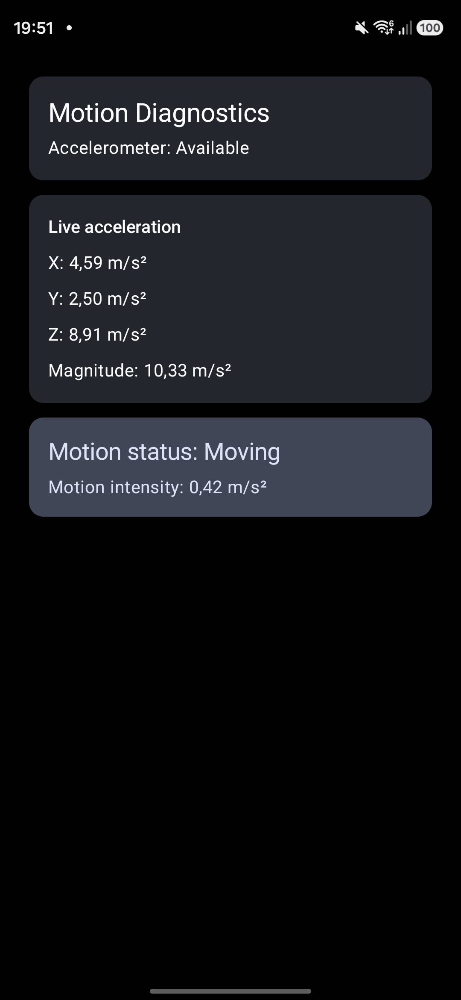
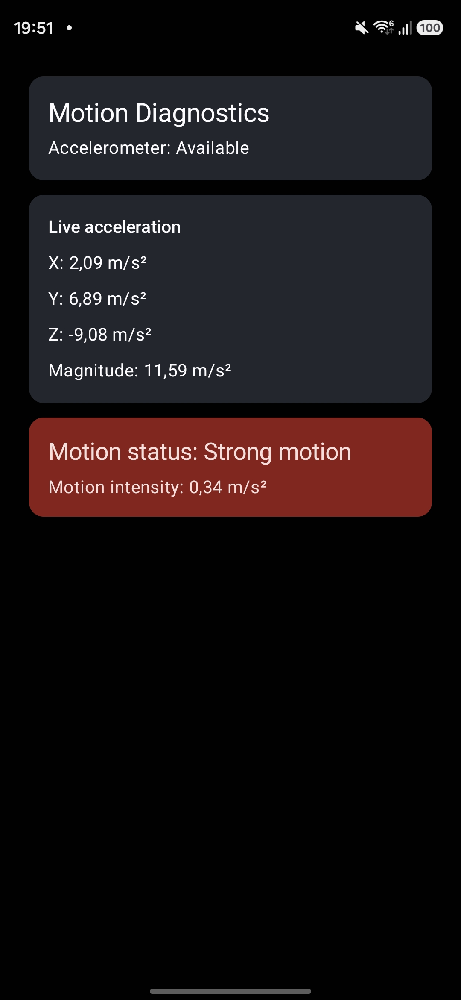
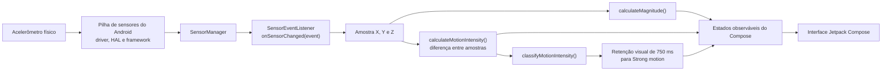

# Android Motion Telemetry Diagnostics

Aplicação Android que lê o acelerômetro do dispositivo, apresenta telemetria em tempo real e classifica a variação entre amostras como movimento estável, movimento moderado ou movimento forte.

O projeto foi desenvolvido em Kotlin com Jetpack Compose como uma entrega curta e demonstrável voltada ao estudo de Android embarcado. O escopo prioriza integração real com hardware, ciclo de vida correto, processamento testável e uma interface que possa ser executada em um celular comum.

## Visão geral

| Item | Implementação |
|---|---|
| Plataforma | Android |
| Linguagem | Kotlin |
| Interface | Jetpack Compose + Material 3 |
| Sensor | Acelerômetro |
| API mínima | 26 |
| API de destino | 37 |
| Aquisição | `SensorManager` e `SensorEventListener` |
| Testes | 6 testes unitários com JUnit 4 |
| Permissões | Nenhuma permissão de execução |
| Root ou ROM modificada | Não necessários |
| Status | Versão funcional e demonstrável |

## Problema abordado

Aplicações ligadas a dispositivos embarcados precisam transformar amostras de hardware em informações que possam ser monitoradas e interpretadas.

Este projeto implementa um fluxo reduzido desse problema:

1. localizar o acelerômetro disponível no dispositivo;
2. registrar um listener enquanto a tela está ativa;
3. receber os valores dos eixos X, Y e Z;
4. calcular a magnitude da aceleração;
5. comparar amostras consecutivas;
6. classificar a intensidade da variação;
7. publicar os resultados em estados observáveis pela interface;
8. interromper a aquisição quando a tela deixa de estar ativa.

## Funcionalidades

- detecção da disponibilidade do acelerômetro;
- leitura contínua dos eixos X, Y e Z;
- exibição dos valores em `m/s²`;
- cálculo da magnitude do vetor de aceleração;
- cálculo da variação entre amostras consecutivas;
- classificação em `Stable`, `Moving` e `Strong motion`;
- cartão de diagnóstico com cor dependente do estado;
- retenção visual de `Strong motion` por 750 ms;
- registro e cancelamento do listener conforme o ciclo de vida;
- reinicialização do diagnóstico ao sair da tela;
- testes unitários para cálculos, classificações e limites.

## Demonstração

Com o aplicativo aberto em um dispositivo físico:

1. mantenha o celular parado para observar `Stable`;
2. mova-o lentamente para observar `Moving`;
3. faça um movimento firme e controlado para observar `Strong motion`.

O estado forte permanece visível por 750 ms para que possa ser lido. A aquisição do sensor não é interrompida durante esse período.

Não é necessário bater, derrubar ou movimentar o aparelho de forma perigosa.

### Demonstração visual

| `Stable` | `Moving` | `Strong motion` |
|---|---|---|
|  |  |  |

[Assista à demonstração completa em vídeo (MP4)](docs/media/motion-diagnostics-demo.mp4).

Na terceira captura, `Strong motion` ainda aparece enquanto a intensidade instantânea já caiu para `0.34 m/s²`. Isso é esperado: uma amostra anterior ultrapassou o limite de `2.0 m/s²`, e o alerta forte permanece visível por 750 ms enquanto as leituras continuam sendo atualizadas.

## Exemplo de saída

Os valores abaixo são apenas ilustrativos:

```text
Motion Diagnostics
Accelerometer: Available

Live acceleration
X: 0.12 m/s²
Y: -0.08 m/s²
Z: 9.79 m/s²
Magnitude: 9.79 m/s²

Motion status: Stable
Motion intensity: 0.02 m/s²
```

A magnitude próxima de `9.81 m/s²` com o aparelho parado é esperada porque a leitura bruta do acelerômetro inclui a gravidade.

## Arquitetura e fluxo de dados



O aplicativo utiliza a API pública `SensorManager`. Driver, HAL e framework aparecem no diagrama para representar as camadas inferiores do caminho do dado, mas não são implementados nem acessados diretamente por este projeto.

## Processamento

### Magnitude

A magnitude combina os três eixos em um único valor:

```text
magnitude = sqrt(x² + y² + z²)
```

Ela representa o comprimento do vetor de aceleração medido pelo sensor e inclui a contribuição da gravidade.

### Intensidade de movimento

A intensidade utilizada pelo diagnóstico é a magnitude da diferença entre duas amostras consecutivas:

```text
deltaX = currentX - previousX
deltaY = currentY - previousY
deltaZ = currentZ - previousZ

intensity = sqrt(deltaX² + deltaY² + deltaZ²)
```

Essa medida representa mudança no vetor de aceleração entre amostras. Ela não representa velocidade, distância percorrida ou impacto físico.

## Classificação e calibração

| Intensidade | Classificação |
|---:|---|
| `< 0.10 m/s²` | `Stable` |
| `>= 0.10 m/s²` e `< 2.0 m/s²` | `Moving` |
| `>= 2.0 m/s²` | `Strong motion` |

Os limites foram definidos empiricamente a partir de observações no dispositivo usado durante o desenvolvimento:

| Situação observada | Faixa aproximada |
|---|---:|
| Aparelho parado | `0.00–0.03 m/s²` |
| Movimento lento | `0.38–1.88 m/s²` |
| Movimento firme | `2.32–5.15 m/s²` |

Esses valores não constituem calibração universal. Modelo do sensor, frequência efetiva de amostragem, filtragem do fabricante, orientação e padrão do movimento podem alterar o resultado.

## Decisões de ciclo de vida

### `onCreate`

- obtém o `SensorManager`;
- localiza o acelerômetro padrão;
- define o estado de disponibilidade;
- configura a interface Compose.

### `onResume`

- registra a `MainActivity` como listener;
- solicita `SENSOR_DELAY_UI`, adequado para atualização visual.

### `onPause`

- cancela o listener;
- limpa a leitura anterior;
- limpa diagnóstico, intensidade e retenção visual;
- impede aquisição desnecessária quando a tela não está ativa.

O Android pode ajustar a frequência real e agrupar eventos. `SENSOR_DELAY_UI` é uma preferência de entrega, não uma garantia de período fixo.

## Testes

Os testes unitários cobrem:

1. magnitude conhecida para o vetor `(3, 4, 0)`;
2. intensidade zero para duas amostras iguais;
3. valores representativos dos três estados;
4. limite exato de `0.10f`;
5. limite exato de `2.0f`;
6. intensidade conhecida para duas amostras com diferença `(3, 4, 0)`.

Para executar no Windows:

```powershell
.\gradlew.bat test --console=plain
```

Em macOS ou Linux:

```bash
./gradlew test --console=plain
```

Para executar a análise estática:

```powershell
.\gradlew.bat lintDebug --console=plain
```

## Como executar

### Requisitos

- Git;
- Android Studio compatível com Android Gradle Plugin 9.4.1;
- Android SDK 37 instalado;
- dispositivo Android API 26 ou superior;
- acelerômetro no dispositivo;
- depuração USB habilitada para execução por cabo.

### 1. Clone o repositório

```powershell
git clone https://github.com/paulomatheuz/android-embedded-systems-lab.git
cd android-embedded-systems-lab/android-motion-telemetry-diagnostics
```

### 2. Abra o projeto

No Android Studio, abra diretamente a pasta:

```text
android-motion-telemetry-diagnostics
```

Aguarde a sincronização do Gradle terminar.

### 3. Execute

1. conecte um celular com depuração USB;
2. aceite a autorização no dispositivo;
3. selecione o dispositivo na barra do Android Studio;
4. execute a configuração `app`.

O acelerômetro comum não exige permissão em tempo de execução.

## Como gerar o APK

No Windows:

```powershell
.\gradlew.bat assembleDebug --console=plain
```

O arquivo será criado em:

```text
app/build/outputs/apk/debug/app-debug.apk
```

O APK de debug é adequado para demonstração e instalação manual, mas não representa uma versão assinada para publicação em loja.

## Estrutura principal

```text
android-motion-telemetry-diagnostics/
├── app/
│   └── src/
│       ├── main/
│       │   ├── java/com/paulomatheuz/motiondiagnostics/
│       │   │   ├── MainActivity.kt
│       │   │   └── MotionMath.kt
│       │   └── res/values/strings.xml
│       └── test/java/com/paulomatheuz/motiondiagnostics/
│           └── MotionMathTest.kt
├── docs/
│   └── media/
│       ├── motion-diagnostics-demo.mp4
│       ├── motion-diagnostics-moving.jpg
│       ├── motion-diagnostics-stable.jpg
│       └── motion-diagnostics-strong-motion.jpg
├── gradle/
├── build.gradle.kts
├── gradlew
├── gradlew.bat
├── README.md
└── settings.gradle.kts
```

### Responsabilidades

- `MainActivity.kt`: aquisição do sensor, ciclo de vida, estados e interface;
- `MotionMath.kt`: cálculos e classificação independentes do Android;
- `MotionMathTest.kt`: validação automatizada das regras matemáticas;
- `strings.xml`: textos apresentados pela interface.

## Relação com Android embarcado

O projeto demonstra responsabilidades comuns em sistemas Android conectados a hardware:

- consumo de dados originados em um sensor físico;
- uso da abstração oferecida pelo framework Android;
- processamento contínuo baseado em callbacks;
- transformação de telemetria em diagnóstico;
- separação de regras matemáticas para testes locais;
- respeito ao ciclo de vida e ao consumo de recursos;
- tratamento explícito da ausência do sensor.

O aplicativo não implementa driver ou HAL e não afirma acesso direto ao hardware. Ele atua na camada de aplicação, acima da pilha de sensores do Android.

## Limitações conhecidas

- utiliza somente o acelerômetro padrão;
- as leituras brutas incluem gravidade;
- rotação do aparelho altera a projeção da gravidade nos eixos e pode ser classificada como movimento;
- utiliza diferença entre amostras, sem filtro passa-baixas ou passa-altas;
- os limites dependem do dispositivo e da frequência efetiva de amostragem;
- não calcula velocidade, distância, orientação ou impacto;
- não persiste nem exporta telemetria;
- não coleta dados em segundo plano;
- não controla diretamente a taxa real de entrega dos eventos;
- mantém estado e interface na `MainActivity` para preservar o escopo curto;
- não acessa HAL, driver, root ou APIs privadas.

As limitações são mantidas explícitas para que o projeto seja apresentado de forma tecnicamente honesta.

## Possíveis evoluções

- separar gravidade e aceleração linear;
- aplicar filtragem ou média móvel;
- calcular e exibir a taxa de amostragem;
- adicionar metadados do sensor;
- registrar uma janela limitada de amostras;
- exportar telemetria para CSV;
- mover estado e aquisição para componentes dedicados;
- adicionar testes de interface;
- avaliar outros sensores, como giroscópio.

## Contexto de desenvolvimento

O projeto foi desenvolvido incrementalmente. Os commits registram desde a criação do aplicativo e detecção do acelerômetro até telemetria, testes, classificação, interface e revisão final.

A prioridade foi entregar uma aplicação pequena, real e demonstrável, compreendendo cada etapa em vez de simular uma integração mais complexa que não pudesse ser concluída e validada no tempo disponível.

---

Desenvolvido por [Paulo Matheus](https://github.com/paulomatheuz).

Este é um projeto pessoal e educacional desenvolvido com APIs públicas do Android.
