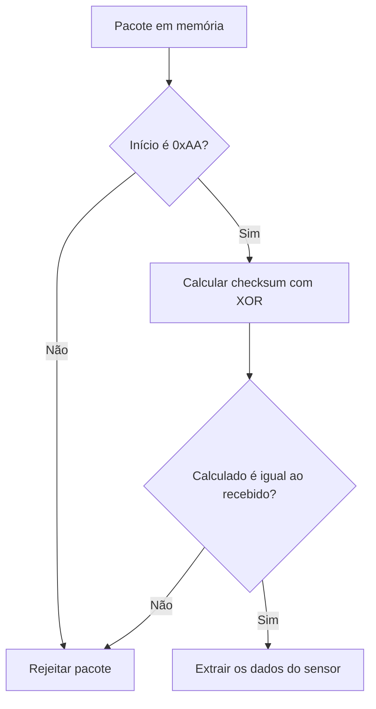

# Native Sensor Packet Decoder

Decoder de pacotes de sensor desenvolvido em C para demonstrar fundamentos de comunicação binária, validação de dados, operações bit a bit e testes automatizados aplicáveis a sistemas embarcados.

O programa processa um pacote fixo de cinco bytes, valida seu marcador inicial, recalcula o checksum com XOR e extrai os dados somente quando o pacote é considerado válido.

## Visão geral

| Item | Descrição |
|---|---|
| Linguagem | C |
| Interface | Terminal |
| Compilador | GCC |
| Testes | 6 verificações com `assert` |
| Protocolo | Pacote fixo de 5 bytes |
| Checksum | XOR |
| Android/JNI | Fora do escopo desta versão |
| Status | Primeira versão funcional concluída |

Este projeto integra um laboratório de estudos práticos em sistemas embarcados e concentra-se na camada nativa e no processamento confiável de dados binários.

O escopo foi mantido propositalmente pequeno: a prioridade foi desenvolver uma implementação funcional, testável e compreensível dos fundamentos nativos antes de adicionar Android, JNI ou comunicação real com hardware.

## Problema abordado

Sistemas embarcados frequentemente recebem sequências de bytes provenientes de sensores, controladores ou interfaces de comunicação.

Antes de usar esses dados, o software precisa:

- identificar o início do pacote;
- interpretar cada campo na posição correta;
- verificar se os dados chegaram de forma consistente;
- rejeitar pacotes inválidos;
- disponibilizar os valores para as próximas camadas do sistema.

Este projeto implementa uma versão reduzida desse fluxo.

## Formato do pacote

O pacote utilizado possui cinco bytes:

```text
AA 01 17 64 D8
```

| Índice | Byte | Campo | Interpretação |
|---:|:---:|---|---:|
| `0` | `AA` | Marcador inicial | Início válido |
| `1` | `01` | Tipo do sensor | 1 |
| `2` | `17` | Temperatura | 23 |
| `3` | `64` | Bateria | 100 |
| `4` | `D8` | Checksum recebido | `D8` |

Cada elemento é armazenado como `uint8_t`, representando exatamente um byte sem sinal.

## Fluxo de validação



Os campos do sensor só são interpretados depois das duas validações.

## Cálculo do checksum

O checksum é calculado aplicando XOR aos quatro primeiros bytes:

```text
checksum = início ^ tipo ^ temperatura ^ bateria
```

Para o pacote atual:

```text
AA ^ 01 ^ 17 ^ 64 = D8
```

O byte de checksum recebido não participa do cálculo. Ele é usado posteriormente para comparação:

```text
calculado: D8
recebido:  D8
```

O XOR utilizado aqui é uma verificação simples de integridade. Ele não é um mecanismo criptográfico.

## Funcionalidades

- representação de um pacote binário como array de bytes;
- uso de `uint8_t` para representar cada campo;
- validação do marcador inicial `0xAA`;
- cálculo de checksum com XOR;
- comparação entre checksum calculado e recebido;
- rejeição de marcador inicial inválido;
- rejeição de checksum inválido;
- extração do tipo do sensor;
- extração da temperatura;
- extração do nível de bateria;
- exibição hexadecimal e decimal;
- seis verificações automatizadas com `assert`.

## Organização da lógica

A implementação separa as principais regras em funções:

- `byte_inicial_valido()` verifica o marcador inicial;
- `calcular_checksum()` calcula o XOR dos bytes de dados;
- `checksum_valido()` compara os valores calculado e recebido;
- `main()` coordena o fluxo do programa.

Essa separação permite testar as regras individualmente e reduz a repetição de lógica.

## Testes

O projeto utiliza `assert`, disponível na biblioteca padrão de C.

Os seis casos atuais verificam:

1. aceitação do marcador `0xAA`;
2. rejeição do marcador `0xAB`;
3. checksum `0xD8` para o pacote principal;
4. checksum `0x07` para um segundo conjunto conhecido;
5. aceitação de checksums iguais;
6. rejeição de checksums diferentes.

Os testes são executados no início do programa. Quando todos passam, nenhuma mensagem adicional é exibida. Se uma condição falhar, a execução é interrompida e a linha relacionada é informada.

## Como executar

### Requisitos

- Git;
- GCC com suporte a C11;
- PowerShell.

A implementação foi desenvolvida e validada no Windows com GCC.

### 1. Clone o repositório

```powershell
git clone https://github.com/paulomatheuz/android-embedded-systems-lab.git
cd android-embedded-systems-lab/native-sensor-packet-decoder
```

### 2. Crie a pasta de saída

```powershell
New-Item -ItemType Directory -Force output
```

### 3. Compile

```powershell
gcc -Wall -Wextra -std=c11 main.c -o .\output\main.exe
```

As opções `-Wall` e `-Wextra` ativam verificações adicionais do compilador.

### 4. Execute

```powershell
.\output\main.exe
```

## Exemplo de saída

```text
AA D8
Byte inicial valido!
Checksum recebido: D8
Checksum calculado: D8
Checksum valido!
Tipo do sensor: 1
Temperatura: 23
Bateria: 100
```

## Estrutura

```text
native-sensor-packet-decoder/
├── .gitignore
├── main.c
└── README.md
```

A pasta `output/` contém o executável gerado localmente e não é versionada.

## Decisões de escopo

### Por que um pacote fixo?

O pacote fixo permitiu concentrar o desenvolvimento nos fundamentos do protocolo:

- organização dos bytes;
- acesso por índices;
- representação hexadecimal;
- validação;
- checksum;
- testes.

Entrada dinâmica e validação de tamanho são evoluções posteriores.

### Por que não usar JNI agora?

JNI adicionaria uma camada de integração antes de a lógica nativa estar consolidada.

Nesta versão, o objetivo foi isolar e testar o parser em C. Uma implementação futura poderia transformar essa lógica em uma biblioteca nativa consumida por uma camada Android.

### Por que usar XOR?

XOR oferece uma forma simples de exercitar operações bit a bit e detectar alterações básicas nos dados.

Para um protocolo real, o algoritmo de integridade seria definido pelos requisitos do dispositivo e poderia utilizar mecanismos mais robustos.

## Relação com Android embarcado

Este projeto não é uma aplicação Android e não simula uma integração que ainda não foi implementada.

Sua relação com Android embarcado está na responsabilidade que o código representa: receber bytes de uma camada de comunicação, validar o protocolo e disponibilizar informações confiáveis para as camadas superiores.

Em uma evolução futura, essa lógica poderia fazer parte de:

- uma biblioteca nativa em C;
- um serviço de comunicação com hardware;
- uma camada responsável por interpretar dados de sensores;
- uma integração JNI com uma aplicação ou serviço Android.

A separação atual em funções facilita essa evolução sem acoplar antecipadamente o parser à plataforma Android.

## Competências demonstradas

Este projeto apresenta prática com:

- arrays e índices;
- representação de bytes;
- `uint8_t`;
- decimal, binário e hexadecimal;
- operações bit a bit;
- operador XOR;
- condicionais;
- funções, parâmetros e retornos;
- validação de dados;
- testes com `assert`;
- compilação com avisos habilitados;
- leitura e investigação de erros;
- organização incremental do código;
- Git e GitHub.

## Limitações conhecidas

- processa apenas um pacote fixo;
- utiliza um formato de exatamente cinco bytes;
- não recebe dados de arquivo, dispositivo ou usuário;
- não possui validação de tamanho;
- não suporta diferentes formatos de pacote;
- utiliza checksum XOR simples;
- mantém aplicação e testes no mesmo arquivo;
- ainda não possui integração com Android, JNI ou hardware real.

As limitações são explícitas para evitar apresentar o projeto como algo maior do que sua implementação atual.

## Próximas evoluções

- receber pacotes dinamicamente;
- validar o tamanho antes de acessar os índices;
- representar os campos em uma estrutura própria;
- separar declarações, implementação e testes;
- suportar diferentes tipos de sensor;
- ampliar os casos inválidos;
- ler dados de arquivo ou interface de comunicação;
- transformar o parser em uma biblioteca nativa;
- avaliar integração com Android somente após consolidar a camada em C.

## Contexto de desenvolvimento

O projeto foi desenvolvido de forma incremental, com pequenas entregas funcionais e commits específicos para cada evolução.

A estratégia foi priorizar profundidade sobre quantidade: implementar um fluxo pequeno, compreender cada conceito utilizado, testar os caminhos principais e manter as limitações documentadas.

---

Desenvolvido por [Paulo Matheus](https://github.com/paulomatheuz).
